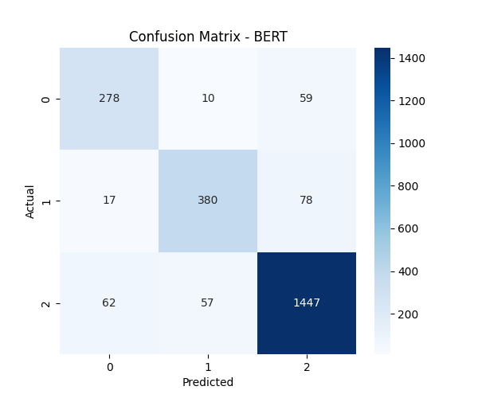
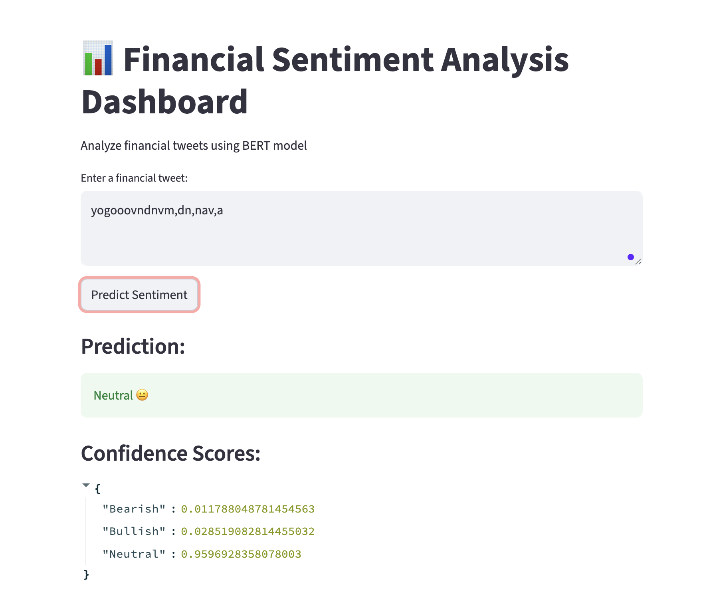

# 📊 Financial Sentiment Analysis using Deep Learning & BERT

An end-to-end NLP project that classifies financial tweets into **Bearish, Bullish, and Neutral** sentiments using deep learning models and transformer-based BERT.

---

## 🚀 Project Overview

This project compares multiple models:

- LSTM  
- GRU  
- Bidirectional GRU (Bi-GRU)  
- BERT (Final Model)

The goal is to identify the best-performing model for financial sentiment classification and deploy it using Streamlit.

---

## 📂 Project Structure
├── data/
│ ├── sent_train.csv
│ ├── sent_valid.csv
│
├── models/
│ └── bert_model/
│
├── notebooks/
│ ├── 1_EDA.ipynb
│ ├── 2_RNN_LSTM_GRU.ipynb
│ ├── 3_BERT.ipynb
│
├── app.py
├── README.md


---

## 📊 Model Performance

| Model   | Accuracy | Macro F1 |
|--------|---------|----------|
| LSTM   | 66%     | 0.26     |
| GRU    | 79%     | 0.71     |
| Bi-GRU | 80%     | 0.73     |
| BERT   | **88%** | **0.85** |

---

## 🧠 Key Insights

- LSTM struggled due to class imbalance  
- GRU improved performance with simpler architecture  
- Bi-GRU captured better context using bidirectional learning  
- **BERT outperformed all models using attention-based contextual understanding**

---

## 📊 Confusion Matrix (BERT)

> Shows strong performance across all classes



---

## 🖥️ Streamlit Dashboard

The project includes an interactive Streamlit app:

### Features:
- Input financial tweet
- Predict sentiment (Bearish / Bullish / Neutral)
- Display confidence scores
- Probability bar chart
- Dataset class distribution visualization



---

## ▶️ How to Run the App

```bash
pip install -r requirements.txt
streamlit run app.py
